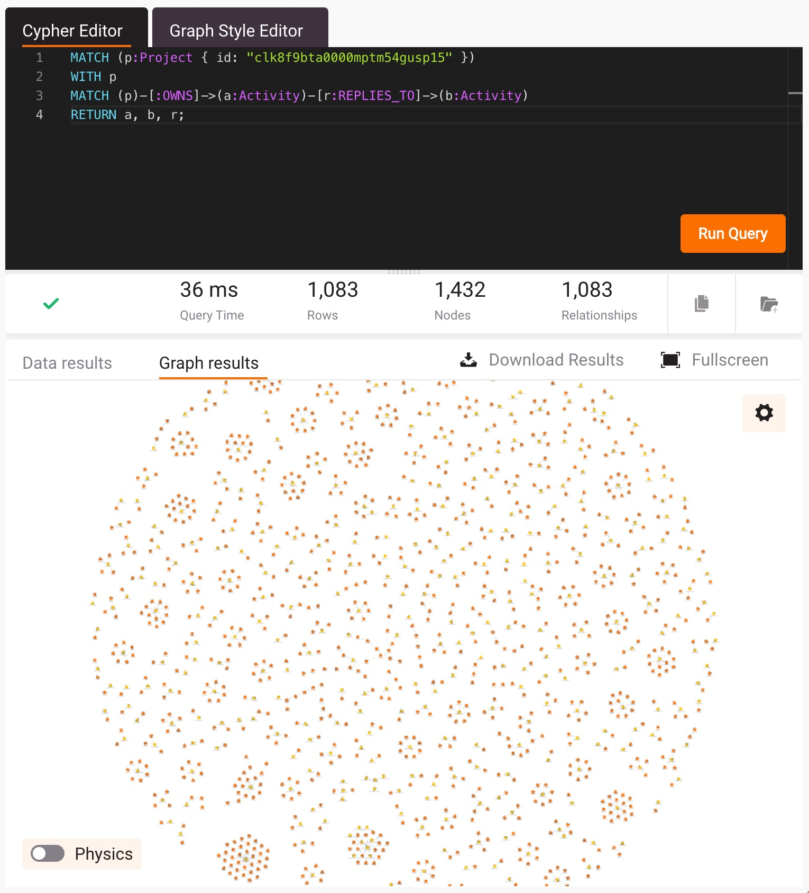

# Use Memgraph Lab

If you'd like to explore your data with graph queries and graph
visualizations, you can use [Memgraph Lab](https://memgraph.com/product/memgraph-lab).

Memgraph Lab is an application that allows you to connect to
Memgraph databases, run graph queries, and visualize the results. It
runs as an app or in your browser, so you don't need to install anything.
If you're using the Docker image for local development, you can already
access Memgraph Lab on a port exposed by the container, by default 3000.

## Run queries

Here's an example query that you can use to get started.
This query finds all activities that are replies to other activities within the scope of a project. It returns the nodes `a`, `b` and the edge `r` between them so that the graph can be constructed.

```
MATCH (p:Project { id: "<project-id>" })
  WITH p
  MATCH (p)-[:OWNS]->(a:Activity)-[r:REPLIES_TO]->(b:Activity)
RETURN a, b, r;
```



## Interpreting graphs

In this image of a community we can see that there are some conversations
where the original post (yellow) has lots of direct replies (orange).
These are often announcements or introductions. They look like a wheel with
a hub and spokes.

We can also see that there are some conversations that are more like a sprawling
tree, either a line of sequential replies or branches in multiple directions.
There are more likely to be provacative discusssions or support requests that
require lots of back and forth to resolve.

This is just the tip of the iceberg and only looking at one kind of node, the
activities. There are many more insights to be found.
