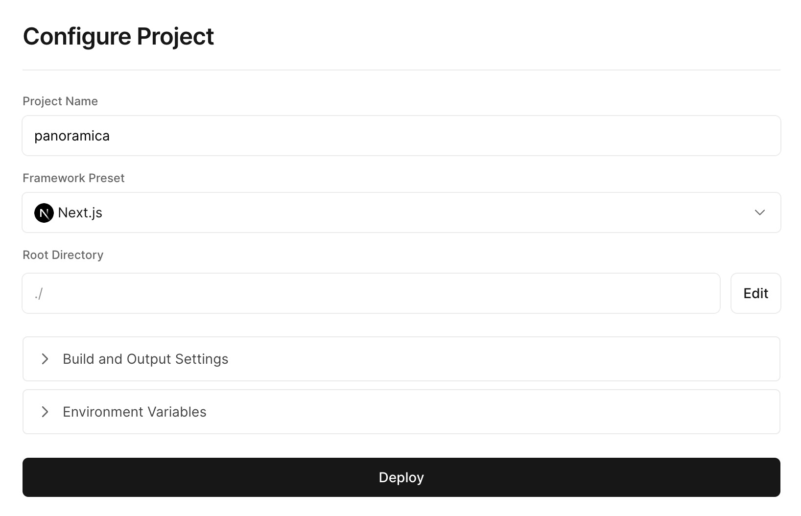

# Deployment

This guide will walk you through how to deploy Panoramica to Vercel or another Next.js hosting provider. This guide assumes you have a GitHub repository for your Panoramica instance
and are deploying to [Vercel](https://vercel.com/).

## Create a Vercel Project

Log in to your Vercel dashboard. On the Vercel Dashboard, click `Add New...`. On the next page, choose the GitHub repository of your Panoramica instance.

On the next step, keep the defaults and add some environment variables.



The environment variables you need to provide are:

- `NEXTAUTH_SECRET` - [guide to generate](https://next-auth.js.org/configuration/options#secret)
- `NEXTAUTH_URL` - the URL for magic link email login e.g. `https://my-panoramica.vercel.app`
- `SMTP_FROM`, `SMTP_HOST`, `SMTP_PORT`, `SMTP_USERNAME`, `SMTP_PASSWORD` for sending login emails

Later on we will add the environment variables for PostgreSQL and Memgraph.

Click Deploy once you've provided the variables. This process will take a minute or two.
It will fail because we haven't set up the databases and added those environment
variables yet.

## Set up PostgreSQL

You can use Vercel PostgreSQL as an easy way to set up a database for your
Panoramica instance to use. To do that, click **Storage** in the header of your Vercel project. Follow the steps and create a PostgreSQL instance in the region of your choice.

Elect to use the database for all environments (or at least the production environment). That will set up your environment variables automatically.

If you already have a PostgreSQL instance you'd like to use,
you can add the environment variables manually.

```text
POSTGRES_PRISMA_URL=<connection-string>
POSTGRES_URL_NON_POOLING=<connection-string>
```

## Set up Memgraph

Next, we need to set up Memgraph. You have a few options here.
First, you can use the [Memgraph Cloud](https://cloud.memgraph.com/) service.
Second, you can deploy Memgraph to a cloud provider of your choice. This
guide covers using [Docker Compose to deploy Memgraph](https://memgraph.com/docs/memgraph/reference-guide/deployment/docker).

Once you have Memgraph running, add the environment variables to your Vercel project.

```text
MEMGRAPH_URI=bolt+ssc://<hostname>:<port>
MEMGRAPH_PASSWORD=<password>
MEMGRAPH_USERNAME=<username>
```

## Redeploy the Vercel Project

Now that all the environment variables and databases are in place,
go to the last build that failed in the Vercel project and click
"Redeploy".

During this step, the database tables and schema will automatically be created thanks
to the `vercel-build` command in `package.json`. This command will
run on every future deployment to run any new migrations via Prisma.

## Log in for the first time

If the deployment succeeded, you should now be able to log in and create a user.

Verify that you can log in via email, create a project, import data,
and see the data on the UI.

## Additional options

### Add a custom domain

In the Settings of your Vercel app, you'll find a Domains tab.
Here you can point a domain that you own to your Vercel deployment.
Make sure to update the `NEXTAUTH_URL` environment variable if you
plan to use the custom domain for login.

### Link the project locally

To be able to run commands with the `vercel` command-line tool and interact with your
deployment locally, link your project like this from within the project directory:

```shell
npm install -g vercel # if you don't have it
vercel link
```
