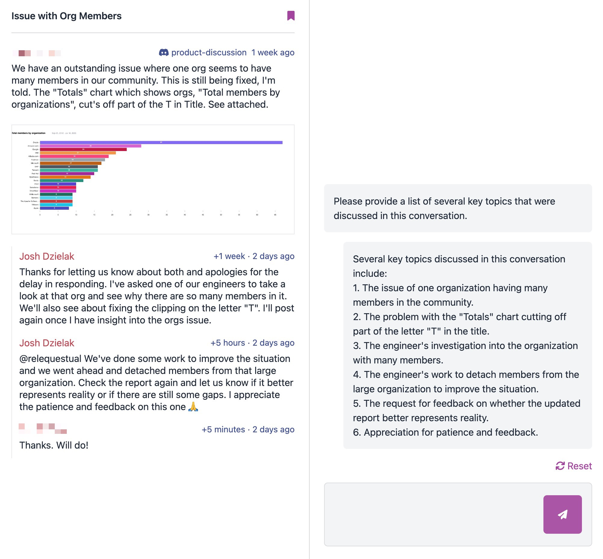
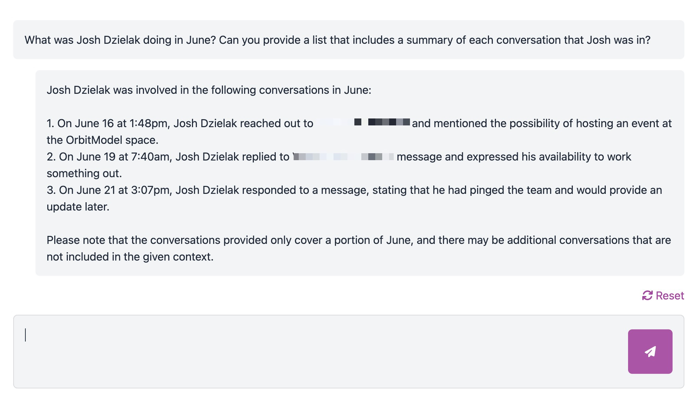

# AI Assistant

There are 2 contexts in which you can use the AI features in Panoramica. The context helps determine what information is provided to the AI so that it has the best chance of generating useful results.

## Conversation Context

The first is in the context of a single conversation. In this mode, the AI is given the whole conversation to analyze. The AI will also look for related conversations that may be useful in understanding the current one and performing tasks like generating replies.

## Project Context

The second is in the context of the entire project. In this context, Panoramica tries to find the best snippets of the project's conversation history to provide to the AI, based on what the user has requested.

In this example, Panoramica ensures that the AI is aware of conversations in the month of June where someone named Josh was a participant.

Both contexts should be considered in beta and experimental mode for now. This is a major and exciting area of development for the project. We will publish a list of questions and tasks that the AI works well for in each context soon, so watch this space!
