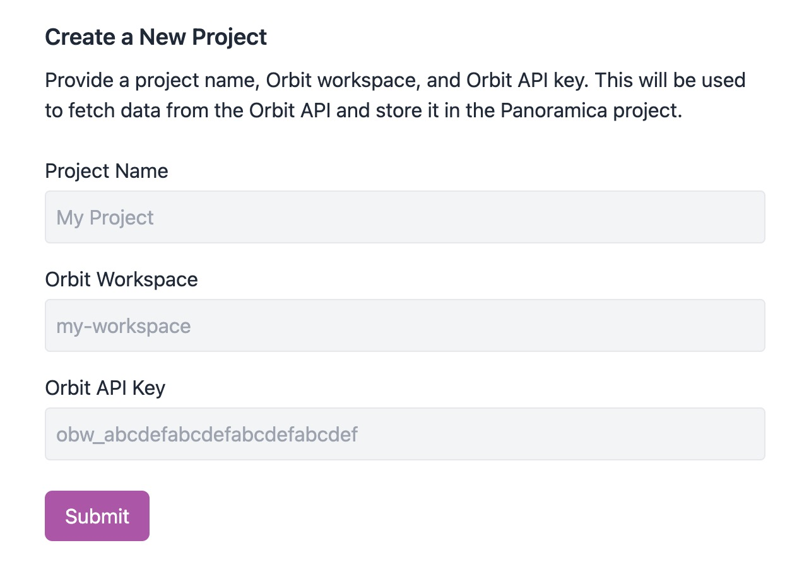
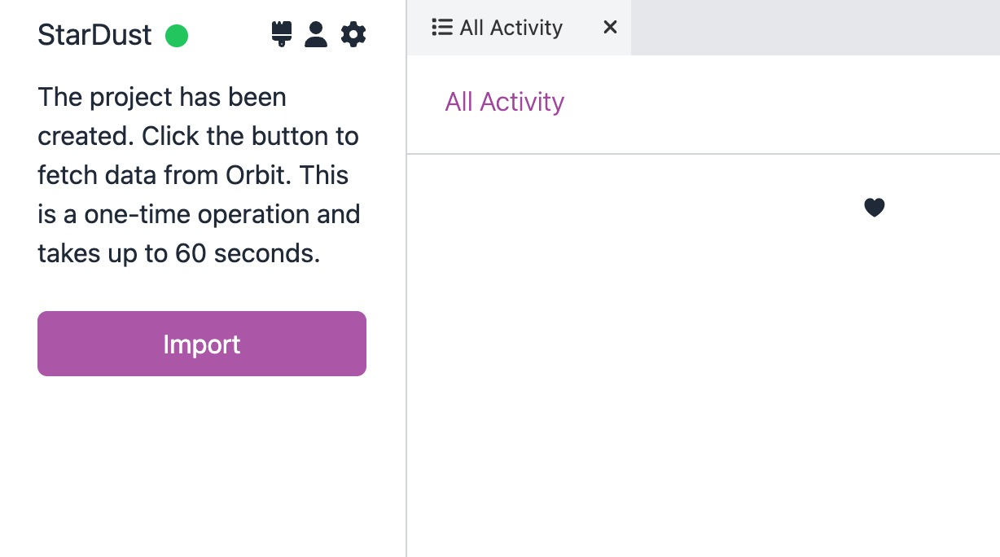

# Create a Project

To create a project, click head to the Dashboard of your Panoramica instance.
You'll see a form to create a new project.

- **Name** is the name of the project. This is used in the UI to identify the project.
- **Orbit Workspace** is the id of the Orbit workspace that contains the data you want to import. The id of the workspace is the part in the URL on app.orbit.love.
- **Orbit API Key** is the API key for the Orbit workspace. You can generate an API key in the Orbit settings. We recommend using a [workspace API token](https://orbit.love/docs/all/api-tokens#51526766b5394f7e83c0a1fc01543330).

:::note

If you're planning to use the Panoramica API to import data, put in dummy values for the
Orbit fields for now.

:::

## Importing data

Once you've created the project, you'll be taken to the primary UI and you'll
see an Import button. Click the button and wait up to 1 minute for data to
be imported.

Once complete, the screen should refresh and you'll see conversations
in the All Activity widget.

## Enabling AI features

To enable AI features, you'll need to provide several more pieces of information.
To do this, click the gear / settings icon in the Home widget. This will open
up a widget to edit the project settings.

To enable AI features, provide the following:

- **Model Name** is the name of the OpenAI model to use for text generation. You can find the model name in the OpenAI API settings.
- **API Key** is the API key for the OpenAI API. You can find the API key in the OpenAI API settings.
- **Pinecone API Env** is the name of the Pinecone environment to use for embeddings. You can find the environment name in the Pinecone API settings.
- **Pinecone API Key** is the API key for the Pinecone API. You can find the API key in the Pinecone API settings.
- **Pinecone Index Name** is the name of the Pinecone index to use for embeddings. You can find the index name in the Pinecone API settings.

We plan to support more models and vector databases in the future. Since we already use
LangChain, it's already possible to try different combinations in the code, but this isn't
quite yet doable purely from the UI.

:::note

If you'd like to try out the AI features but don't want to set up your own OpenAI and Pinecone
accounts, you can use defaults that we have on the Orbit Panoramica instance. Fill out the [form on the home page](/#request-access) and we'll cover this when we get you set up.

:::
