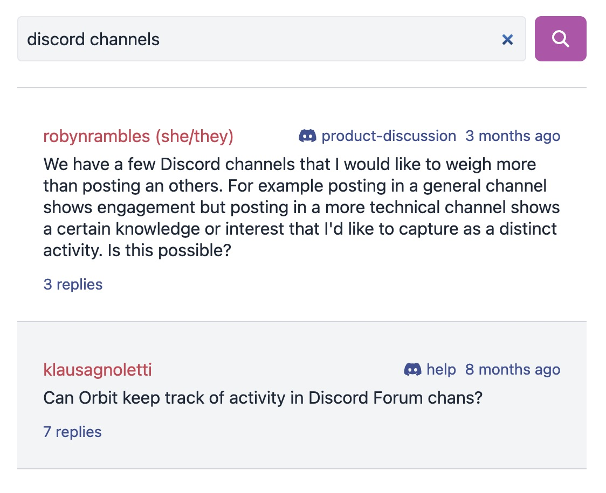

# Search

Panoramica has a search widget that allows you to search the conversations in your community. You can access the widget by typing a query in the search box in the Home (leftmost) widget and clicking
the button or hitting enter.

Inside the widget you can revise your query and re-submit the search.
You can also type in a new query into the Home widget and open
search results for more queries.

In the search results, you'll be shown messages that match the search
in order of relevance determined by the search engine. You can expand or open each conversation from there.

:::info

The search is under development and does not produce good results
for all queries yet. It is a semantic search and does not yet have the features to make it better at keyword search. YMMV. If you're interested in vector search and/or keyword search, we're looking for contributions in this area. There's so much potential for great conversation search!

:::
